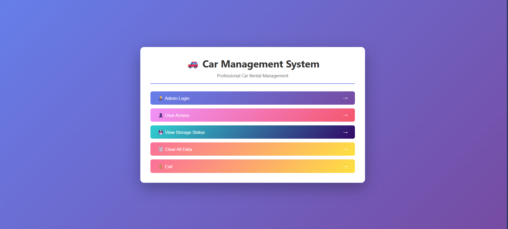
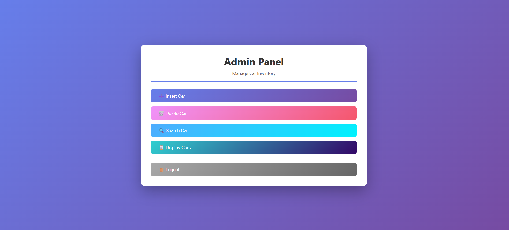

# 🚗 Car Management System

A comprehensive web-based car rental management system implementing six different data structures with localStorage persistence.


## 📋 Table of Contents

- [Features](#features)
- [Demo](#demo)
- [Data Structures](#data-structures)
- [Installation](#installation)
- [Usage](#usage)
- [Screenshots](#screenshots)
- [Project Structure](#project-structure)
- [Technical Details](#technical-details)
- [Contributing](#contributing)
- [License](#license)

## ✨ Features

### Admin Features
- 🔐 Secure admin authentication
- ➕ Add cars to inventory across multiple data structures
- 🗑️ Delete cars from inventory
- 🔍 Search for specific cars by ID
- 📊 Display all cars in any data structure
- 💾 Automatic data persistence with localStorage

### User Features
- 📝 User registration and login system
- 🛒 Add cars from admin stock to personal cart
- ❌ Remove cars from cart
- 🔍 Search admin inventory
- 💰 View total rental cost
- 📋 View personal cart across different data structures

### System Features
- 💾 Full localStorage persistence (data survives page refresh)
- 📱 Responsive design for all devices
- 🎨 Modern gradient UI with smooth animations
- ✅ Input validation and error handling
- 🔄 Real-time data updates
- 📊 Storage status monitoring

## 🎮 Demo

### Default Credentials

**Admin Access:**
- Password: `admin`

**Demo User Account:**
- Username: `demo`
- Password: `demo`

## 🗂️ Data Structures

This project implements six fundamental data structures:

| Data Structure | Max Capacity | Operations | Time Complexity |
|---------------|--------------|------------|-----------------|
| **Array** | 100 cars | Insert (sorted), Delete, Search | O(n) |
| **Linked List** | Unlimited | Insert (sorted), Delete, Search | O(n) |
| **Stack** | Unlimited | Push, Pop, Search | O(1) push/pop, O(n) search |
| **Queue** | Unlimited | Enqueue, Dequeue, Search | O(1) enqueue/dequeue, O(n) search |
| **Graph** | 10 nodes | Insert, Delete, Search | O(n) |
| **Binary Search Tree** | Unlimited | Insert, Delete, Search | O(h) average O(log n) |

### Data Structure Use Cases

- **Array**: Regular sedan inventory with fast access
- **Linked List**: Frequently changing inventory
- **Stack**: Newest arrivals (LIFO - Last In First Out)
- **Queue**: Rental queue processing (FIFO - First In First Out)
- **Graph**: Premium/exotic cars (limited network)
- **Binary Search Tree**: Large searchable inventory

## 🚀 Installation

### Option 1: Direct Download

1. Clone the repository:
```bash
git clone https://github.com/NoshinStar/car-management-system.git
cd car-management-system
```

2. Open `car-management.html` in your web browser

### Option 2: GitHub Pages

1. Fork this repository
2. Go to Settings → Pages
3. Select main branch as source
4. Access via: `https://NoshinStar.github.io/car-management-system/`

### Option 3: Local Server (Optional)

```bash
# Using Python
python -m http.server 8000

# Using Node.js
npx http-server

# Then open http://localhost:8000
```

## 📖 Usage

### Admin Workflow

1. **Login as Admin**
   - Click "Admin Login"
   - Enter password: `admin`

2. **Insert Cars**
   - Select "Insert Car"
   - Choose data structure
   - Enter car details (ID, Brand, Model, Price)
   - Click "Insert Car"

3. **Manage Inventory**
   - Delete cars by ID or use Stack/Queue operations
   - Search for specific cars
   - Display all cars in any data structure

### User Workflow

1. **Register/Login**
   - Click "User Access"
   - Register new account or login

2. **Browse and Rent**
   - Search admin stock
   - Add cars to your cart
   - View total rental cost

3. **Manage Cart**
   - Remove cars from cart
   - View cart across different data structures
   - See total weekly rental cost

## 📸 Screenshots

### Main Menu


### Admin Panel


### User Cart


## 📁 Project Structure

```
car-management-system/
│
├── car.html                 # Main HTML file with structure and styling
├── car.js                   # Core logic and data structure implementations
├── README.md                # Project documentation
└── screenshots/             # Screenshot directory
    ├── main-menu.png
    ├── admin-panel.png
    └── user-cart.png
```

## 🔧 Technical Details

### Technologies Used
- **HTML5**: Structure and semantics
- **CSS3**: Styling with modern gradients and animations
- **JavaScript (ES6+)**: Core logic and data structures
- **LocalStorage API**: Data persistence

### Key Implementations

#### Data Structure Classes
```javascript
- DS_Array: Sorted array with binary insertion
- DS_List: Singly linked list with sorted insertion
- DS_Stack: LIFO stack using linked nodes
- DS_Queue: FIFO queue using linked nodes
- DS_Graph: Graph with adjacency representation
- DS_Tree: Binary Search Tree with recursive operations
```

#### Storage Keys
```javascript
Admin: admin_array, admin_list, admin_stack, admin_queue, admin_graph, admin_tree
User: user_array, user_list, user_stack, user_queue, user_graph, user_tree
Auth: users
```

### Browser Compatibility
- ✅ Chrome 60+
- ✅ Firefox 55+
- ✅ Safari 11+
- ✅ Edge 79+

### LocalStorage Limits
- Maximum storage: 5-10MB per origin
- Data persists until manually cleared
- Separate storage per browser


## 🛠️ Development

### Adding New Features

1. **New Data Structure**:
   - Create class in `car.js`
   - Add localStorage save/load methods
   - Update UI in `car.html`

2. **New User Role**:
   - Add authentication logic
   - Create menu structure
   - Implement specific operations

3. **Enhanced Features**:
   - Add search filters
   - Implement sorting options
   - Create reports/analytics

### Testing

Test all CRUD operations:
```javascript
// Test in browser console
console.log(adminDS.array.display());
console.log(userDS.tree.getTotalPrice());
```

## 🤝 Contributing

Contributions are welcome! Please follow these steps:

1. Fork the repository
2. Create a feature branch (`git checkout -b feature/AmazingFeature`)
3. Commit your changes (`git commit -m 'Add some AmazingFeature'`)
4. Push to the branch (`git push origin feature/AmazingFeature`)
5. Open a Pull Request

### Contribution Ideas
- [ ] Add more data structures (Hash Table, Heap, Trie)
- [ ] Implement data export (CSV, JSON, PDF)
- [ ] Add dark mode toggle
- [ ] Create admin dashboard with charts
- [ ] Add car images and categories
- [ ] Implement advanced search filters
- [ ] Add booking date/time functionality
- [ ] Create REST API backend integration
- [ ] Add unit tests
- [ ] Implement password encryption

## 👨‍💻 Author
Noshin Nawar

## 🙏 Acknowledgments

- Inspired by classic data structure implementations in C++
- UI design influenced by modern web design trends
- Built as an educational project demonstrating practical data structure applications

## 🔮 Future Roadmap

- [ ] Backend integration with Node.js/Express
- [ ] Database integration (MongoDB/PostgreSQL)
- [ ] JWT authentication
- [ ] Email notifications
- [ ] Payment gateway integration
- [ ] Mobile app version (React Native)
- [ ] Advanced analytics dashboard
- [ ] Multi-language support
- [ ] PDF invoice generation
- [ ] Real-time updates with WebSocket

---

⭐ **Star this repo if you find it helpful!**

Made with ❤️ by [Noshin Nawar]
